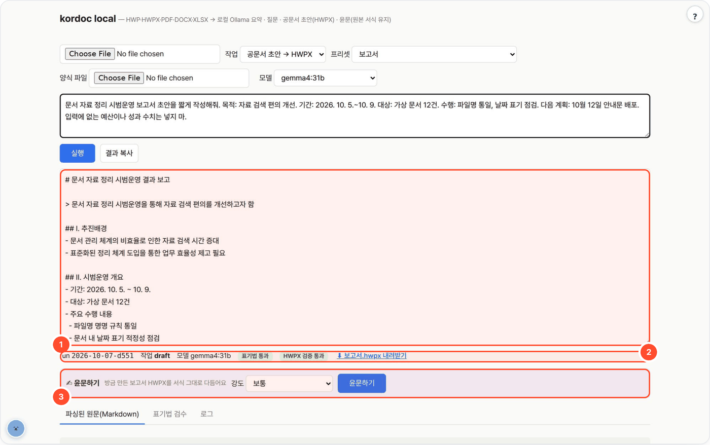
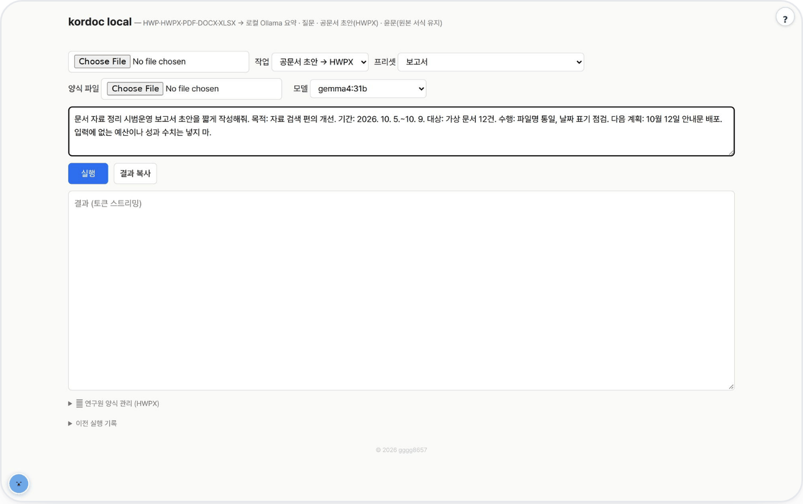

# kordoc-local — 문서 읽기와 HWPX 초안

HWP·HWPX·PDF·DOCX·XLSX 문서를 로컬 LLM으로 요약하거나 질문에 답하고, 요청만으로 공문서 초안을 만들어 **한컴에서 바로 열리는 HWPX**로 내려받는 웹 UI / CLI입니다.



## 무엇을 하나

- 오픈소스 한국 공문서 파서 [kordoc](https://github.com/chrisryugj/kordoc)(MIT)을 폐쇄망의 Ollama나 vLLM에 붙여 쓰는 문서 에이전트입니다. 스캔본은 내장 OCR로 읽습니다.
- **요약 · 질문**: 문서 근거로 개조식 요약·답변(근거가 없으면 "문서에 없음").
- **공문서 초안 → HWPX**: LLM이 초안을 쓰면 kordoc이 표기법 검사 → 프리셋 기반 HWPX 생성 → 구조 검증을 수행합니다.
- **윤문**: 문장만 다듬고 **원본 HWPX/HWP 서식(표·박스·글자모양)은 그대로** 둔 채 다시 내려줍니다.
- 파이썬은 표준 라이브러리만, 문서 엔진은 Node 20 위에서 돌며 한컴오피스·클라우드 API·API 키가 필요 없습니다. `KORDOC_OFFLINE=1`로 kordoc 아웃바운드를 전량 차단합니다.

## 사용 방법

포털 경유(`http://<포털>:8700/t/kordoc-local/`) 또는 단독 실행(`http://localhost:8766`) 화면에서:

1. **파일 또는 작성 요청을 넣는다** — 요약·질문은 문서를 올리고, 초안은 파일 없이 요청만 적어도 됩니다.
2. **작업과 양식을 선택한다** — 작업(요약 / 질문 / 공문서 초안 → HWPX)을 고르고, 초안은 보고서·계획서 등 프리셋이나 등록한 HWPX 양식을 고른 뒤 **실행**. 생성된 본문이 결과 칸에 나옵니다. (그림 ①)
3. **검수 뒤 HWPX를 받는다** — 표기법 검수 통과·HWPX 구조 검증 상태를 보고 **⬇ HWPX 내려받기**(그림 ②). **표기법 검수**·**로그** 탭도 확인합니다. 필요하면 **✍ 윤문하기**로 방금 만든 문서를 선택한 강도로 다시 다듬습니다(그림 ③).

긴 문서는 앞 12,000자(`MAX_CHARS`)만 모델에 들어갑니다.

## 예시

가상 자료 정리 사례를 `gemma4:31b` · 작업 "공문서 초안 → HWPX" · 프리셋 보고서로 실제 실행했습니다(파일 없이 요청만).

요청:

```text
문서 자료 정리 시범운영 보고서 초안을 짧게 작성해줘. 목적: 자료 검색 편의 개선. 기간: 2026. 10. 5.~10. 9. 대상: 가상 문서 12건. 수행: 파일명 통일, 날짜 표기 점검. 다음 계획: 10월 12일 안내문 배포. 입력에 없는 예산이나 성과 수치는 넣지 마.
```

결과 `보고서.hwpx` (HWPX 구조 검증 통과) 본문 발췌:

```text
문서 자료 정리 시범운영 결과 보고
기간: 2026. 10. 5. ~ 10. 9.
대상: 가상 문서 12건
향후 계획: 2026. 10. 12. 안내문 배포 예정
```

날짜 범위의 물결표 앞뒤 공백에 표기 경고 1건이 남았습니다. 구조 검증과 내용 검토는 각각 확인하세요.

<details><summary>입력 화면</summary>



</details>

## 실행 — 스크립트 하나

```bash
bash setup.sh                                    # macOS / Linux / Windows Git Bash
powershell -ExecutionPolicy Bypass -File setup.ps1   # Windows PowerShell
```

순서: OS 감지 → 패키지 확보(없으면 clone) → Python 3.9+ 확인 → Node 20+ 확인(없으면 이 폴더 안 `node/` 에 설치, 시스템 안 건드림) →
`npm install kordoc` → LLM 서버 탐색(Ollama :11434 → vLLM :8000 → LM Studio :1234 → llama.cpp :8080) → 없으면 Ollama 설치·기동·모델 pull →
`selftest.py` → 웹 서버 기동 → 브라우저. 종료는 `bash setup.sh stop`.

이미 있는 서버를 쓰려면: `LLM_BASE_URL=http://gpu-server:8000/v1 bash setup.sh`

## 수동 실행

```bash
npm install && python3 selftest.py              # kordoc 설치 + LLM 없이 왕복 검증
python3 app.py                                  # Ollama, http://localhost:8766
LLM_API=openai LLM_BASE_URL=http://gpu-server:8000/v1 LLM_MODEL=Qwen3-32B python3 app.py

python3 app.py --cli summary 문서.hwpx
python3 app.py --cli qa 문서.pdf "3장 예산 총액은?"
python3 app.py --cli draft 문서.hwpx "개선방안 보고서 초안" 보고서     # 문서 없이는 -
python3 app.py --cli polish 문서.hwpx standard                           # 윤문: light | standard | strong → $WORKSPACE/<run>/03_result.hwpx
```

| 환경변수 | 기본 | 설명 |
|---|---|---|
| `LLM_API` | `ollama` | `ollama` 또는 `openai` |
| `LLM_BASE_URL` | `http://localhost:11434` / `http://localhost:8000/v1` | 서버 주소 |
| `LLM_MODEL` | `qwen3:8b` | 기본 모델 (UI에서 변경 가능) |
| `LLM_API_KEY` | (없음) | OpenAI 호환 서버에 키가 필요할 때 |
| `NUM_CTX` | `16384` | Ollama 컨텍스트 창 |
| `MAX_CHARS` | `12000` | 문서 앞부분 컷 (모델 컨텍스트에 맞춰 조정) |
| `PORT` | `8766` | |
| `KORDOC_OFFLINE` | (없음) | `1` 이면 kordoc 아웃바운드 전량 차단 (폐쇄망 권장) |
| `WORKSPACE` | `./_workspace` | 실행 결과 저장 위치 (포털이 `_data/kordoc-local` 로 지정) |

[agent-page-portal](https://github.com/gggg8657/agent-page-portal)에서 띄우면 `PORT`·`WORKSPACE`를 포털이 정하고, LLM 설정은 포털 프로세스의 환경변수를 물려받습니다. 현재 운영 기본값은 로컬 Ollama의 `gemma4:31b`입니다. 단독 실행 시 코드 기본값은 `qwen3:8b`입니다.

## 파이프라인

| 작업 | 흐름 | LLM 콜 |
| --- | --- | ---: |
| 요약 | 문서 → `kordoc` parse → 개조식 요약 | 1 |
| 질문 | 문서 → `kordoc` parse → 근거 인용 답변 (없으면 "문서에 없음") | 1 |
| 공문서 초안 | (문서) → LLM 이 kordoc 규약 Markdown 작성 → `kordoc lint --munche` 표기법·문체 검수 → `kordoc generate --preset` → `validate` → HWPX 내려받기 | 1 |
| 윤문 | 문서 → `kordoc parse --keep-layout-tables` → 문단·목록·표 셀을 `[번호] 조각`으로 묶어(2,500자 단위, 2개 병렬) LLM 윤문 → 게이트(숫자·날짜·「」·영문·○○ 기호가 바뀌거나 길이가 0.55~1.5배를 벗어나면 원문 유지) → `kordoc lint` → **HWPX/HWP: `kordoc patch` 로 원본 서식 그대로 반영**, 위치 매핑이 잠긴 조각(표로 만든 제목 막대·요약 박스 안 등)은 `textpatch.mjs` 가 문단 텍스트 대조로 run·글자모양 유지한 채 반영 → 다시 파싱해 반영 여부 확인 → `validate`. 그 밖의 형식(PDF·DOCX·MD 등)은 서식을 되돌릴 원본이 없으므로 선택한 프리셋으로 새 HWPX 생성 | 문서 길이÷2,500자 |

프리셋: 보고서 · 기안문 · 간이기안문 · 계획서 · 통지 · 회의록 · 개조식 · 업무보고 · 서울방침 · 보도자료.

**연구원 양식(HWPX)** — 웹 UI 하단 "📁 연구원 양식 관리"에서 기관 양식을 올려 두면 공문서 초안의 프리셋 목록 "연구원 양식"에서 고른다(`forms/` 에 저장, git 제외).
**HWPX 만 받는다** — kordoc 은 HWPX 일 때만 원본 서식을 지키고, HWP 를 채우면 글꼴·칸 크기가 바뀐다. HWP 는 한글에서 *파일 → 다른 이름으로 저장 → HWPX* 로 바꿔 올린다.
올리면 `forms.py` 가 종류를 판별한다(목록에서 바꿀 수 있음).
- **칸 채우기형**(출장 정산서·제출서류 등): 누름틀과 표의 라벨 칸(kordoc `fill --dry-run`)을 LLM 에 주고, 받은 값을 `kordoc fill` 로 원본 서식 그대로 채운다. `(사유)` 처럼 칸 안에 제목만 있는 큰 칸은 제목 아래에 글을 붙인다.
- **본문 작성형**(보고서 양식처럼 Ⅰ 장 막대·□·○·-·※·표 제목·표·참고 상자 견본이 있는 양식): 앞부분(표지·제목·날짜 줄)의 안내 글은 LLM 이 실제 값으로 바꾸고,
  본문은 견본 문단·표 XML 을 복제해 글만 바꿔 새로 짠다 — 글꼴·크기·내어쓰기·장 막대 모양이 양식 그대로. 표는 행·열 수에 맞춰 견본 모서리 칸의 테두리(바깥 굵은 선·안쪽 가는 선·첫 열 바탕색)를 조합한다. 양식의 원래 견본 본문·안내 상자는 버린다.
- 아직 안 되는 것: 이력서의 경력·학력처럼 **견본 줄을 반복**해야 하는 표·목록(다음 단계), 미리보기(kordoc render)에서 표지 위치가 한글과 조금 다를 수 있음(한글은 열 때 다시 배치).

**기안문 · 간이기안문**은 `generate` 프리셋 대신 kordoc 내장 **표준 서식**(「행정 효율과 협업 촉진에 관한 규정 시행규칙」 별지 제1호 일반기안문 / 제2호 간이기안문)을 채운다.
LLM 이 칸 값(행정기관명·수신·경유·제목·본문·붙임·발신명의·기안자·검토자·결재권자·시행번호·주소·연락처… / 간이: 제목·요약설명·작성기관)을 JSON 으로 쓰고 → `kordoc fill` →
본문을 항목마다 문단으로 나눠 `1.` `가.` `1)` `가)` 단계별 **내어쓰기**(둘째 줄이 기호 뒤 글자에 맞춰짐) → `validate`.
붙임이 있으면 `붙임  ○○ 1부.  끝.`(여러 개면 `1.` `2.` 번호), 없으면 본문 끝에 `  끝.`. 재료에 없는 이름·번호·주소는 지어내지 않고 빈칸(한글에서 누름틀 안내문이 보임)으로 둔다.
기관 고정 값(기관명·발신명의·주소·전화·결재라인 등)은 `gian_defaults.json`(현재 **한국원자력연구원**, 형식은 `gian_defaults.example.json`)에 적어 두면 LLM 이 비운 칸을 채운다(문서에 나온 값이 우선, `_고정` 에 넣은 키는 항상 덮어씀). 간이기안문 작성기관에는 기관명이 앞에 붙는다.
윤문은 별도 작업이 아니라 **결과 화면의 "✍ 윤문하기" 버튼**으로 한다: 초안을 만들었으면 그 HWPX를, 요약·질문이면 올렸던 원본 문서를,
윤문 결과면 그 윤문본을 다시 다듬는다(`POST /api/run {"task":"polish","from_run":"<run>","strength":…}`). 내려받는 이름은 `<원본>_윤문.hwpx`.
강도: 가볍게(맞춤법·띄어쓰기·이중 피동·비문만) · 보통 · 적극(간결하게 다시 쓰기). 웹 UI "변경 내역" 탭에서 조각별 원문/윤문 비교(어절 단위 강조)와 원문 유지된 제안·사유를 본다.
결과는 `$WORKSPACE`(기본 `_workspace/`)`/<run>/` 에 남는다(00 원본 · 01 파싱 md · 02 답변/02_polished.md · 03 HWPX·HWP). 지원 입력: hwp hwpx hml pdf docx xlsx xls png jpg webp md txt.

## 폐쇄망 반입

kordoc 은 상시 외부 통신이 없고(OCR 모델 최초 다운로드만), 이 앱은 LLM 서버 외에 아무 데도 붙지 않는다.
네이티브 모듈 때문에 **대상 OS/CPU 를 지정**해 인터넷 되는 PC 에서 번들을 만든다:

```bash
./pack.sh linux-x64            # → dist-offline/kordoc-local-linux-x64.tar.gz (~200MB, OCR 모델 포함)
WITH_NODE=1 ./pack.sh          # 서버에 Node 20+ 가 없으면 바이너리까지 동봉
```

내부망에서는 번들을 풀고 `bash setup.sh` (node_modules·models·node 가 있으면 다운로드 없이 그대로 사용) 또는 번들 안 `INSTALL.md` 대로 수동 실행.
`selftest.py` 는 LLM 없이 kordoc 왕복(HWPX→MD→lint→generate→validate)만 검증하므로 반입 직후 점검용.

## 파일

`app.py` 서버+파이프라인 · `forms.py` 연구원 양식 등록·채우기 · `textpatch.mjs` 윤문 보완 패치 · `gian_defaults.example.json` 기안문 기관 고정 값 예시 · `ui.html` · `goal-prompt.md` 역할 프롬프트 8종 · `selftest.py` · `setup.sh`/`setup.ps1` 원샷 설치 · `pack.sh` 폐쇄망 번들 ·
`sample/dummy.hwpx` · `sample/polish_test.hwpx`(+`.md`, 윤문 테스트용 계획서) · `package.json`(kordoc ^4.17). 출처·라이선스는 `NOTICE`.

### 다른 도구용 글 윤문 API
`POST /api/polish_text {"text": …, "strength": "light|standard|strong"}` → `{output, changes, rejected, units}`. 문서 윤문과 같은 엔진(조각 윤문 + 숫자·날짜·「」·영문·쌍점이 바뀐 조각은 원문 유지). writer·notebook·meeting 의 "✍ 윤문하기" 버튼이 이걸 부른다.

## 출처·감사 (Credits)

- **[kordoc](https://github.com/chrisryugj/kordoc) (MIT, chrisryugj)** — npm 에서 수정 없이 설치해 감쌉니다 (`LICENSE-kordoc`). `sample/dummy.hwpx` 는 kordoc 의 tests/fixtures 에서 가져옴
- OCR 모델 PP-OCRv5 ([PaddlePaddle/PaddleOCR](https://github.com/PaddlePaddle/PaddleOCR), Apache-2.0) — kordoc 의 NOTICE·THIRD_PARTY 참고
- **LLM 실행** — OpenAI 호환 API 로 호출합니다(모델 가중치는 동봉하지 않음). 기본 배포는 [Ollama](https://github.com/ollama/ollama) (MIT) 위의 Google [Gemma](https://ai.google.dev/gemma) `gemma4:31b` — 모델 이용 조건은 Gemma 배포처 참고.
- 이 도구는 [agent-page-portal](https://github.com/gggg8657/agent-page-portal) 에 연결해 쓰도록 만들었습니다(단독 실행도 됨).

저작권 표기·전체 목록은 `NOTICE` 를 보세요.

## 라이선스

[MIT License](LICENSE) © DongJu Kim (gggg8657). 감싸서 쓰는 kordoc 은 MIT(`LICENSE-kordoc`).
